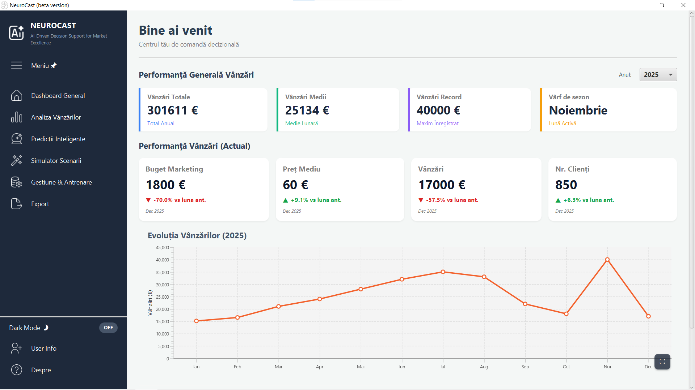

# NeuroCast

Sistem de previziune a vanzarilor bazat pe Retele Neuronale Artificiale (RNA), dezvoltat ca proiect de licenta. Aplicatia permite incarcarea istoricului de vanzari dintr-un fisier Excel, antrenarea unei retele neuronale direct din interfata si generarea de predictii economice si scenarii de tip "ce-ar fi daca", insotite de un dashboard interactiv si export de rapoarte.

---

## Cuprins

- [Descriere](#descriere)
- [Tehnologii utilizate](#tehnologii-utilizate)
- [Capturi de ecran](#capturi-de-ecran)
- [Cerinte de sistem](#cerinte-de-sistem)
- [Instalare si rulare (utilizator final)](#instalare-si-rulare-utilizator-final)
- [Rulare din codul sursa (dezvoltator)](#rulare-din-codul-sursa-dezvoltator)
- [Ghidul interactiv pas cu pas](#ghidul-interactiv-pas-cu-pas)
- [Formatul fisierului de date](#formatul-fisierului-de-date)
- [Structura proiectului](#structura-proiectului)
- [Autor](#autor)

---

## Descriere

Aplicatia este construita in jurul a doua componente principale:

1. **Dashboard analitic** — afiseaza datele economice ale firmei (vanzari lunare, buget de marketing, pret mediu, sezonalitate) incarcate dintr-un fisier Excel, sub forma de grafice interactive, indicatori de performanta si comparatii intre ani.
2. **Modul de previziune** — o retea neuronala artificiala implementata de la zero, care invata din datele istorice si permite generarea de prognoze, simularea de scenarii si optimizarea bugetului in functie de o tinta de vanzari.

Reteaua poate fi antrenata si reconfigurata direct din interfata (rata de invatare, numar de neuroni, momentum, functie de activare Sigmoid sau LeakyReLU), iar modelul antrenat poate fi salvat si reincarcat ulterior.

---

## Tehnologii utilizate

- **Java 17** — limbajul de baza
- **JavaFX 17.0.2** — interfata grafica si graficele interactive
- **Apache POI 5.2.3** — citirea datelor din fisiere Excel (.xlsx)
- **iText 7.2.5** — generarea rapoartelor PDF
- **Log4j 2.17.1** — jurnalizare
- **Maven** — gestionarea dependentelor si build
- Retea neuronala implementata manual (fara biblioteci externe de tip TensorFlow sau DeepLearning4J)

---

## Capturi de ecran

<!-- SCREENSHOT: Adauga aici o captura generala a aplicatiei (Dashboard la prima deschidere). Exemplu:  -->

*(Capturi de ecran vor fi adaugate aici.)*

---

## Cerinte de sistem

- Sistem de operare **Windows 10 / 11** (64-bit)
- Pentru rularea pachetului portabil: **nu este necesara nicio instalare prealabila** (Java este inclus in pachet)
- Pentru rularea din codul sursa: **JDK 17** si **Maven** instalate

---

## Instalare si rulare (utilizator final)

Aceasta este metoda recomandata pentru a folosi aplicatia fara a instala Java sau alte unelte.

1. Mergi la sectiunea **Releases** a acestui repository:
   <!-- LINK: inlocuieste cu link-ul real catre Release, ex: https://github.com/Jhonny-Wf/NeuroCast/releases -->
2. Descarca arhiva `NeuroCast-windows.zip`.
3. Dezarhiveaza arhiva intr-un folder la alegere (de exemplu pe Desktop).
4. Deschide folderul `NeuroCast` rezultat.
5. Dublu-click pe fisierul **`NeuroCast.exe`** pentru a porni aplicatia.

La prima pornire, aplicatia afiseaza automat un ghid interactiv care prezinta principalele functionalitati.

---

## Rulare din codul sursa (dezvoltator)

Daca vrei sa rulezi proiectul direct din cod:

1. Asigura-te ca ai instalat **JDK 17** si **Maven**.
2. Cloneaza repository-ul:
   ```
   git clone https://github.com/Jhonny-Wf/NeuroCast.git
   ```
3. Intra in folderul proiectului:
   ```
   cd NeuroCast
   ```
4. Ruleaza aplicatia cu Maven:
   ```
   mvn clean javafx:run
   ```
   sau, daca folosesti plugin-ul exec configurat in proiect:
   ```
   mvn clean compile exec:java
   ```

Clasa principala (entry point) este `ro.licenta.analiza.Launcher`.

---

## Ghidul interactiv pas cu pas

La prima deschidere, aplicatia porneste automat un ghid interactiv format din 7 pasi. Ghidul poate fi reluat oricand din tab-ul **Despre**, prin optiunea **"Ruleaza ghidul interactiv"**.

### Pasul 1 — Bun venit
Ecranul de intampinare prezinta scopul aplicatiei si te aduce pe Dashboard.

<!-- SCREENSHOT: captura cu pasul 1 al ghidului (ecranul de bun venit) -->

### Pasul 2 — Incarcarea datelor
Din tab-ul **Gestiune & Antrenare** incarci istoricul vanzarilor dintr-un fisier Excel sau importi un model deja antrenat.

<!-- SCREENSHOT: captura cu pasul 2 (incarcarea datelor) -->

### Pasul 3 — Antrenarea retelei
Configurezi numarul de iteratii si functia de activare, apoi pornesti antrenarea retelei neuronale.

<!-- SCREENSHOT: captura cu pasul 3 (antrenarea retelei) -->

### Pasul 4 — Simulatorul de scenarii
Ajustezi sliderele de buget de marketing si pret si urmaresti pe grafic cum se modifica venitul estimat.

<!-- SCREENSHOT: captura cu pasul 4 (simulator de scenarii) -->

### Pasul 5 — Predictii inteligente
Introduci un obiectiv de vanzari, iar modelul calculeaza automat combinatia optima de buget si pret pentru a-l atinge.

<!-- SCREENSHOT: captura cu pasul 5 (predictii inteligente) -->

### Pasul 6 — Dashboard-ul economic
Vizualizezi grafic indicatorii economici si istoricul extras din fisierul Excel; poti filtra datele dupa an.

<!-- SCREENSHOT: captura cu pasul 6 (dashboard economic) -->

### Pasul 7 — Exportul datelor
Generezi un raport profesional in format PDF cu toate graficele, analizele si predictiile.

<!-- SCREENSHOT: captura cu pasul 7 (export date) -->

---

## Formatul fisierului de date

Aplicatia citeste primul sheet dintr-un fisier Excel (.xlsx), incepand cu al doilea rand (primul rand este considerat antet). Coloanele asteptate sunt, in ordine:

| Coloana | Index | Descriere |
|---------|-------|-----------|
| An | 0 | Anul inregistrarii |
| Luna | 1 | Luna (1-12) |
| Sezon | 2 | Sezonul (1-4) |
| Buget marketing | 3 | Bugetul de marketing alocat |
| Pret mediu | 4 | Pretul mediu de vanzare |
| Vanzari | 5 | Vanzarile realizate (valoarea pe care modelul o invata) |

Fisierul `date_fictive_vanzari.xlsx` (cu date fictive) este inclus in repository pentru testare rapida. Il poti incarca direct din aplicatie, din tab-ul Gestiune & Antrenare.

---

## Structura proiectului

```
Sales_predictions_thesis_project/
├── src/main/java/ro/licenta/analiza/
│   ├── Launcher.java          # Punctul de intrare al aplicatiei
│   ├── DashboardApp.java      # Interfata grafica si logica aplicatiei
│   ├── ReteaNeuronala.java    # Reteaua neuronala (forward, backpropagation)
│   ├── Neuron.java            # Modelul unui neuron si functiile de activare
│   ├── ManagerDate.java       # Citirea si normalizarea datelor din Excel
│   └── Main.java              # Modul de antrenare din consola (optional)
├── src/main/resources/        # Iconite, stiluri CSS
├── pom.xml                    # Configuratia Maven
└── README.md
```

---

## Autor

Proiect de licenta dezvoltat de **[numele tau]**.

<!-- NOTA: completeaza numele tau si, optional, universitatea / coordonatorul -->
