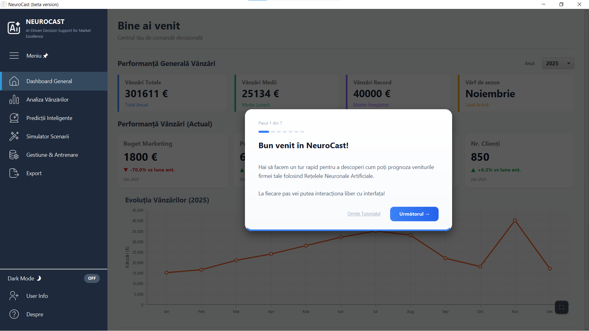
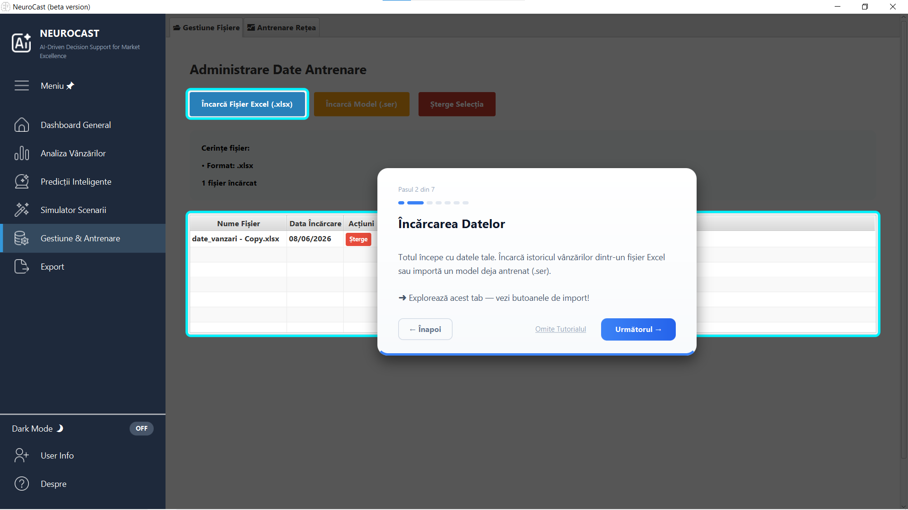
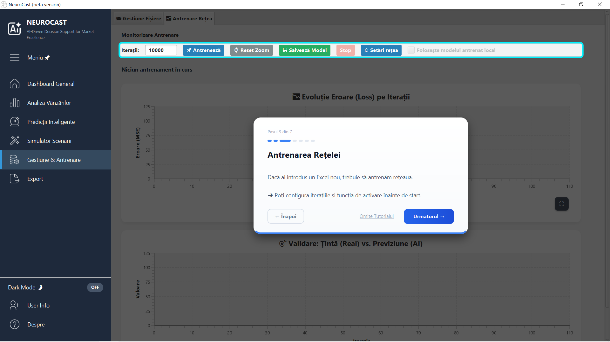
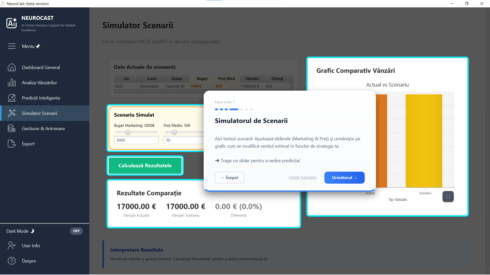
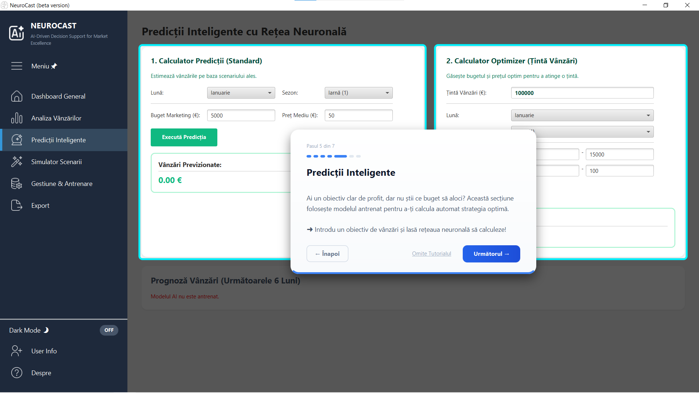
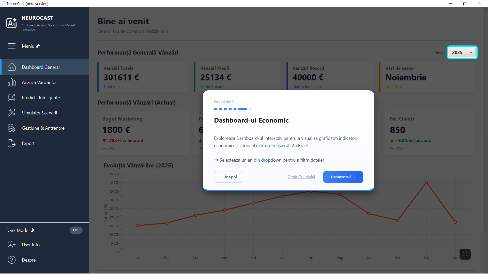
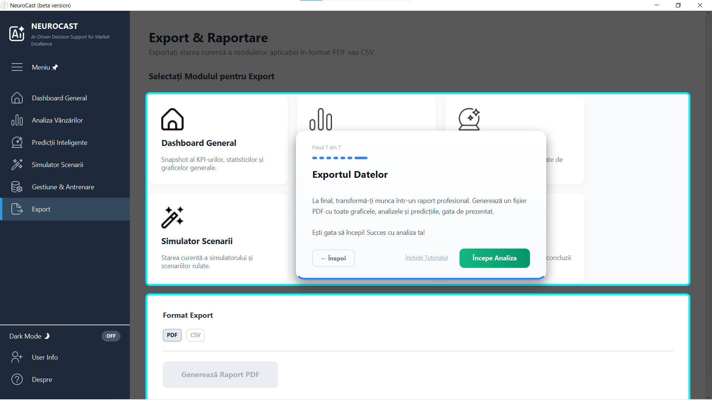
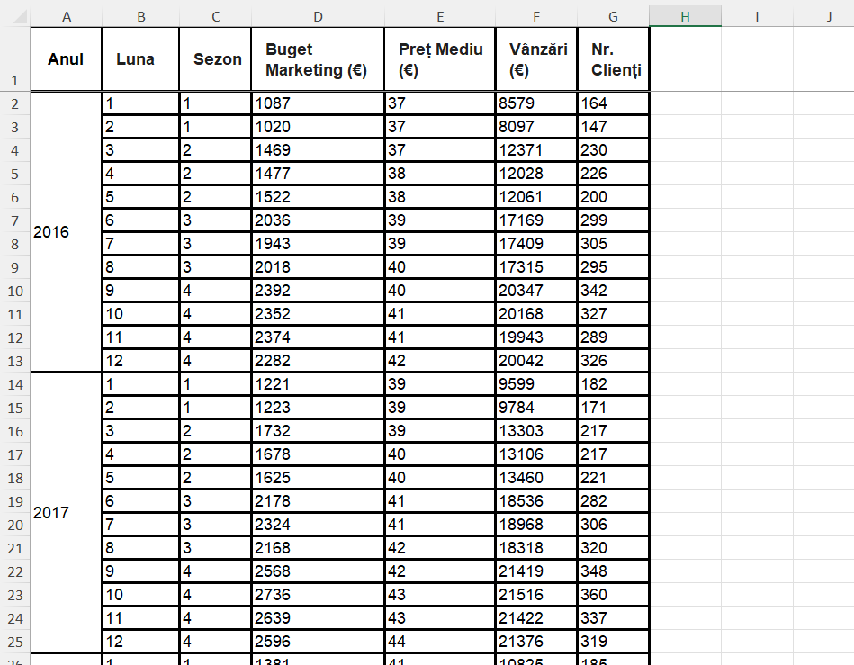

# NeuroCast

Sistem de previziune a vânzărilor bazat pe Rețele Neuronale Artificiale (RNA), dezvoltat ca proiect de licență. Aplicația permite încărcarea istoricului de vânzări dintr-un fișier Excel, antrenarea unei rețele neuronale direct din interfață și generarea de predicții economice și un simulator de scenarii, însoțite de un dashboard interactiv și export de fișiere.

---

## Cuprins

- [Descriere](#descriere)
- [Tehnologii utilizate](#tehnologii-utilizate)
- [Capturi de ecran](#capturi-de-ecran)
- [Cerințe de sistem](#cerinte-de-sistem)
- [Instalare și rulare (utilizator final)](#instalare-si-rulare-utilizator-final)
- [Rulare din codul sursă (dezvoltator)](#rulare-din-codul-sursa-dezvoltator)
- [Ghidul interactiv pas cu pas](#ghidul-interactiv-pas-cu-pas)
- [Formatul fișierului de date](#formatul-fisierului-de-date)
- [Structura proiectului](#structura-proiectului)
- [Autor](#autor)

---

## Descriere

Aplicația este construită în jurul a două componente principale:

1. **Dashboard analitic** — afișează datele economice ale firmei (vânzări lunare, buget de marketing, preț mediu, sezonalitate) încărcate dintr-un fișier Excel, sub formă de grafice interactive, indicatori de performanță și comparații între ani.
2. **Modul de previziune** — o rețea neuronală artificială implementată de la zero, care învață din datele istorice și permite generarea de prognoze, simularea de scenarii și optimizarea bugetului în funcție de o țintă de vânzări.

Rețeaua poate fi antrenată și reconfigurată direct din interfață (rata de învățare, număr de neuroni, momentum, funcție de activare Sigmoid sau LeakyReLU), iar modelul antrenat poate fi salvat și reîncărcat ulterior.

---

## Tehnologii utilizate

- **Java 17** — limbajul de bază
- **JavaFX 17.0.2** — interfața grafică și graficele interactive
- **Apache POI 5.2.3** — citirea datelor din fișiere Excel (.xlsx)
- **iText 7.2.5** — generarea rapoartelor PDF
- **Log4j 2.17.1** — jurnalizare
- **Maven** — gestionarea dependențelor și build
- Rețea neuronală implementată manual (fără biblioteci externe de tip TensorFlow sau DeepLearning4J)

---

## Capturi de ecran


---

## Cerințe de sistem

- Sistem de operare **Windows 10 / 11** (64-bit)
- Pentru rularea pachetului portabil: **nu este necesară nicio instalare prealabilă** (Java este inclusă în pachet)
- Pentru rularea din codul sursă: **JDK 17** și **Maven** instalate

---

## Instalare și rulare (utilizator final)

Aceasta este metoda recomandată pentru a folosi aplicația fără a instala Java sau alte unelte.

1. Mergi la secțiunea **Releases** a acestui repository:
   <!-- LINK: înlocuiește cu link-ul real către Release, ex: https://github.com/Jhonny-Wf/NeuroCast/releases -->
2. Descarcă arhiva `NeuroCast-windows.zip`.
3. Dezarhivează arhiva într-un folder la alegere (de exemplu pe Desktop).
4. Deschide folderul `NeuroCast` rezultat.
5. Dublu-click pe fișierul **`NeuroCast.exe`** pentru a porni aplicația.

La prima pornire, aplicația afișează automat un ghid interactiv care prezintă principalele funcționalități.

---

## Rulare din codul sursă (dezvoltator)

Dacă vrei să rulezi proiectul direct din cod:

1. Asigură-te că ai instalat **JDK 17** și **Maven**.
2. Clonează repository-ul:
   ```
   git clone https://github.com/Jhonny-Wf/NeuroCast.git
   ```
3. Intră în folderul proiectului:
   ```
   cd NeuroCast
   ```
4. Rulează aplicația cu Maven:
   ```
   mvn clean javafx:run
   ```
   sau, dacă folosești plugin-ul exec configurat în proiect:
   ```
   mvn clean compile exec:java
   ```

Clasa principală (entry point) este `ro.licenta.analiza.Launcher`.

---

## Ghidul interactiv pas cu pas

La prima deschidere, aplicația pornește automat un ghid interactiv format din 7 pași. Ghidul poate fi reluat oricând din tab-ul **Despre**, prin opțiunea **"Rulează ghidul interactiv"**.

### Pasul 1 — Bun venit
Ecranul de întâmpinare prezintă scopul aplicației și te aduce pe Dashboard.



### Pasul 2 — Încărcarea datelor
Din tab-ul **Gestiune & Antrenare** încarci istoricul vânzărilor dintr-un fișier Excel sau imporți un model deja antrenat.



### Pasul 3 — Antrenarea rețelei
Configurezi numărul de iterații și funcția de activare, apoi pornești antrenarea rețelei neuronale.



### Pasul 4 — Simulatorul de scenarii
Ajustezi sliderele de buget de marketing și preț și urmărești pe grafic cum se modifică venitul estimat.



### Pasul 5 — Predicții inteligente
Introduci un obiectiv de vânzări, iar modelul calculează automat combinația optimă de buget și preț pentru a-l atinge.



### Pasul 6 — Dashboard-ul economic
Vizualizezi grafic indicatorii economici și istoricul extras din fișierul Excel; poți filtra datele după an.



### Pasul 7 — Exportul datelor
Generezi un raport profesional în format PDF sau CSV cu toate graficele, analizele și predicțiile.



---

## Formatul fișierului de date

Aplicația citește primul sheet dintr-un fișier Excel (.xlsx), începând cu al doilea rând (primul rând este considerat antet). Coloanele așteptate sunt, în ordine:

| Coloana | Index | Descriere |
|---------|-------|-----------|
| An | 0 | Anul înregistrării |
| Luna | 1 | Luna (1-12) |
| Sezon | 2 | Sezonul (1-4) |
| Buget marketing | 3 | Bugetul de marketing alocat |
| Preț mediu | 4 | Prețul mediu de vânzare |
| Vânzări | 5 | Vânzările realizate (valoarea pe care modelul o învață) |
| Nr. clienți | 6 | Numărul de clienți |



Fișierul `date_fictive_vanzari_v1.xlsx` (cu date fictive) este inclus în repository pentru testare rapidă. Îl poți încărca direct din aplicație, din tab-ul Gestiune & Antrenare.

---

## Structura proiectului

```
Sales_predictions_thesis_project/
├── src/main/java/ro/licenta/analiza/
│   ├── Launcher.java          # Punctul de intrare al aplicației
│   ├── DashboardApp.java      # Interfața grafică și logica aplicației
│   ├── ReteaNeuronala.java    # Rețeaua neuronală (forward, backpropagation)
│   ├── Neuron.java            # Modelul unui neuron și funcțiile de activare
│   ├── ManagerDate.java       # Citirea și normalizarea datelor din Excel
│   └── Main.java              # Modul de antrenare din consolă (opțional)
├── src/main/resources/        # Iconițe, stiluri CSS
├── pom.xml                    # Configurația Maven
└── README.md
```

---

## Autor

Lupu Ion 

Proiect de licență dezvoltat în cadrul Universității "Ștefan cel Mare" din Suceava,
Facultatea de Economie și Administrarea Afacerilor, specializarea Informatică Economică.

Tema lucrării: Rolul RNA (rețelelor neuronale artificiale) în managementul unei firme de succes
Coordonator științific: Lect. univ. dr. Paul PAȘCU

---

## Licență

© 2026 Lupu Ion. Toate drepturile rezervate.

Acest proiect a fost realizat ca parte a unei lucrări de licență și este publicat
în scop educațional și demonstrativ. Codul poate fi consultat liber, însă
reproducerea, distribuirea sau reutilizarea sa fără acordul autorului nu este permisă.
